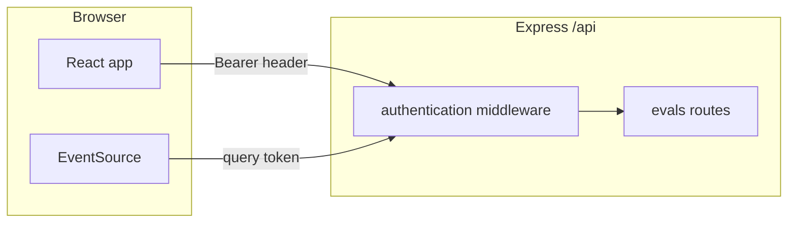

# Security Policy

## Supported Versions

Security fixes are applied to the latest version on the default branch.

## Reporting

Do not report vulnerabilities in a public issue. Use private disclosure through your hosting platform's security advisory flow or private maintainer contact.

## Operational Guidance

- Never commit `.env` files or copied credential exports.
- Rotate any API key that was ever stored outside your secret manager or local env file.
- Set a strong `POSTGRES_PASSWORD` in the root `.env` before running `docker compose up`.
- Set `API_TOKEN` in `backend/.env` if backend reachable by anything other than your own machine. All `/api` routes, including SSE stream access, now enforce this token when set.
- Set `CORS_ORIGIN` in `backend/.env` to exact frontend origin(s). Default only allows local Vite origins.
- Keep `MAX_EVAL_FILE_BYTES` low unless you explicitly need larger uploads.
- Keep the frontend pointed at a trusted backend with `VITE_API_URL`.
- Review provider-specific data handling before sending sensitive eval sets to third-party APIs.

## Verified mitigations (code vs. operational guidance)

| Guidance | Status |
|----------|--------|
| Set `API_TOKEN` when backend is reachable beyond localhost | Enforced in code when the variable is set (optional for local development). |
| `CORS_ORIGIN` exact origin(s) | Implemented in `backend/src/server.ts`; default localhost Vite; in non-production, additional private-network origins on port 5173 are allowed when `CORS_ORIGIN` is unset. |
| `MAX_EVAL_FILE_BYTES` | Enforced via multer in `backend/src/routes/evals.ts`. |
| `VITE_API_URL` trusted backend | Used in `frontend/src/services/api.ts` and `frontend/src/hooks/useEvalStream.ts`. |
| Never commit `.env` | `.gitignore` covers root, `backend/`, and `frontend/` env files; they should not be tracked. |
| Strong `POSTGRES_PASSWORD` | Operational; `docker-compose.yml` defaults to `change-me` if unset—change before real use. |
| Provider / sensitive eval data | Remains an operational and policy concern for third-party APIs. |

## Security audit notes (2026-05-10)

The following items were identified in a repository review. They are **documentation of risk**, not a guarantee that each issue will be fixed; prioritize based on deployment exposure.

1. **Unauthenticated `/health`** (`backend/src/server.ts`) — Exposes database connectivity and optional error text. Low severity for strictly internal use; consider authentication, network restriction, or reduced detail in production.

2. **Information disclosure on `/api/evals/models`** (`backend/src/routes/evals.ts`) — The response includes `runtime.databaseError`. If `API_TOKEN` is unset, this is reachable without credentials; with a token, it can still leak infrastructure details. Consider omitting or redacting in production.

3. **`MOCK_ENABLED` does not gate mock execution** (`backend/src/routes/evals.ts`, `backend/src/evals/runner.ts`) — The models endpoint treats mock as always configured; the runner always accepts `provider: 'mock'` in submitted `modelsConfig`. If mock should be dev-only, enforce an env flag on run creation.

4. **PostgreSQL TLS in production** (`backend/src/db/connection.ts`) — In production, the pool uses `ssl: { rejectUnauthorized: false }`, which disables certificate verification (MITM risk vs. the database path). Prefer CA-backed verification or an explicit secure `DATABASE_URL` / sslmode configuration.

5. **SSE / API token in query string** — `EventSource` cannot send custom headers; the app passes the API token as a query parameter for the stream. That can surface in proxy logs, browser history, and Referer headers. Residual risk; optional hardening includes short-lived stream tokens or cookie-based sessions (with CORS/CSRF tradeoffs).

6. **No security headers middleware** — `backend/src/server.ts` does not use `helmet` or an equivalent. Consider standard security headers (tuned if they interfere with SSE).

7. **Rate limiting** (`backend/src/middleware/rateLimiter.ts`) — In-memory limiter keyed by `req.ip` and path; `trust proxy` is not set, so client identity may be wrong behind reverse proxies; buckets are not shared across multiple server processes.

8. **User-controlled regex in eval sets** (`backend/src/evals/scorer.ts`, `match_type: 'regex'`) — Malicious or pathological patterns could cause excessive CPU (ReDoS). Mitigations include timeouts, safe-regex validation, or disallowing regex for untrusted uploads.

9. **Frontend token storage** (`frontend/src/services/api.ts`) — The API token is stored in `localStorage` under `auth_token`; cross-site scripting could exfiltrate it. There is no CSP configured in `frontend/vite.config.ts`. Rely on a minimal XSS surface and trusted hosting for sensitive deployments.

10. **Dependency / supply chain** — Run `npm audit` periodically in the repo root and in `backend/` and `frontend/`; see **npm audit summary** below for the last recorded run.

### Auth flow (REST vs. SSE)

## npm audit summary

_Last updated: 2026-05-10 — re-run `npm audit` in each workspace and refresh this subsection._

- **Root workspace:** No `package-lock.json`; root `package.json` only orchestrates `npm --prefix` scripts, so `npm audit` at the repo root is not applicable unless a lockfile is added.
- **backend/:** 1 **high** severity finding: transitive `fast-xml-builder` ≤ 1.1.6 (GHSA-5wm8-gmm8-39j9, GHSA-45c6-75p6-83cc). `npm audit fix` may resolve it; verify after upgrading.
- **frontend/:** 0 vulnerabilities reported.
